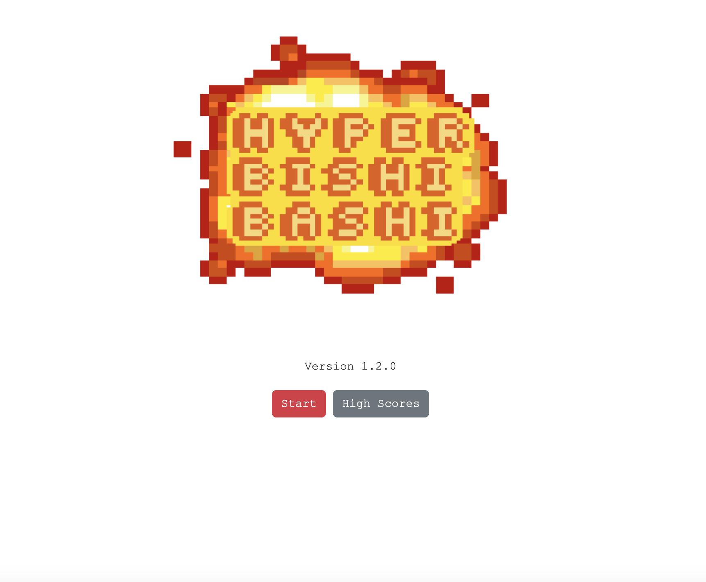
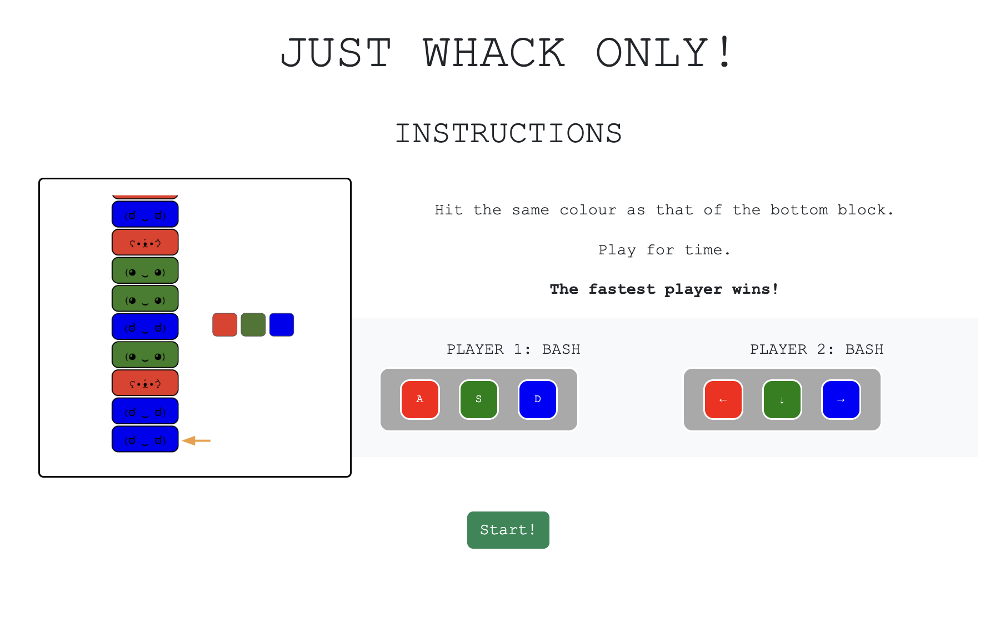
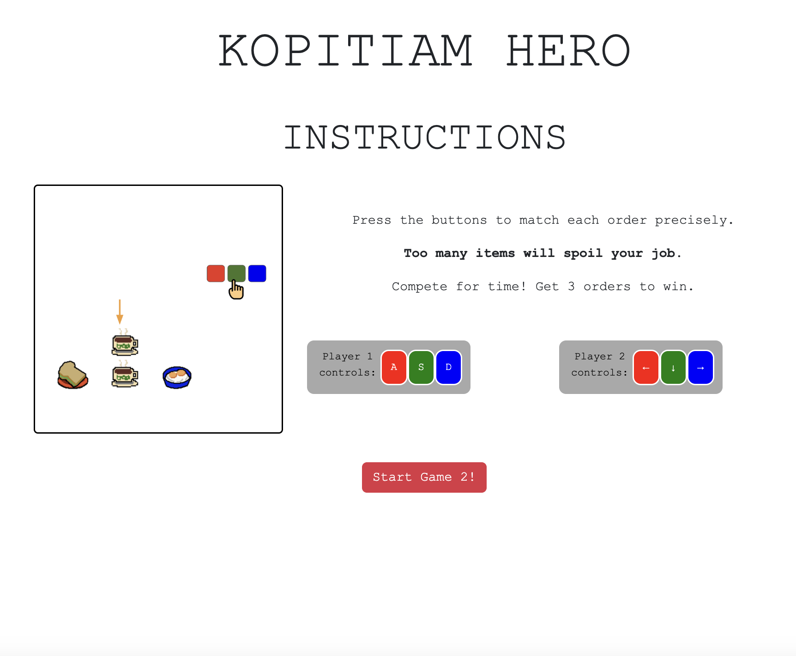
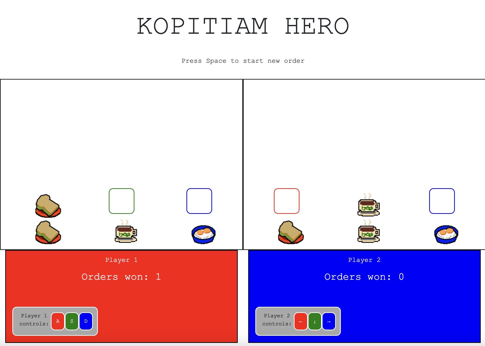

# Hyper Bishi Bashwee

A two-player arcade game where you and your friend can play a series of competitive minigames against each other. 
Inspired by Hyper Bishi Bashi, a 90s arcade game. 

This game was developed as part of my coursework for my Software Engineering Immersive Bootcamp in General Assembly and features original pixel art.

# Screenshots

Sample Game 1

Sample Game 2

# Technologies Used

- JavaScript
- HTML
- CSS
- Bootstrap frontend toolkit

# Getting Started

[Click to Play Hyper Bishi Bashwee!][1]

[1]: https://hyperbishibashwee2.netlify.app/

# Version History

- [v1.2.0][2] - Add 2nd mini game
- [v1.1.0][3] - Introduce competitive gameplay
- [v1.0.0][4] - First version

[2]: https://hyperbishibashwee2.netlify.app
[3]: https://hyperbishibashwee1.netlify.app/
[4]: https://hyperbishibashwee0.netlify.app/

# Next Steps

- More mini-games
- Better error handling

# Credits and references

- [Ezgif gif maker][5] - To create instruction gifs
- [Pixilart][6] - To create pixel art
- [Reference for Sound][7] - Reference to add sound
- [Sounds Source][7] - Source for arcade sounds

  [5]: ezgif.com/
  [6]: https://www.pixilart.com/
  [7]: https://www.w3schools.com/graphics/game_sound.asp
  [8]: https://www.sounds-resource.com/

# Changelog

## 10 Jul 2023 - v1, single player

1. Create readme - done
2. Basic HTML and CSS - done
3. Render high score template - done
4. Render game board - done
5. Event listeners for navigation - done
6. Randomly generate game blocks - done
7. Event listeners to eliminate blocks - done
8. Win condition - done

## 11 Jul 2023 -

1. Fix "Play again" functionality - done
2. Add scorekeeping timer - done
3. Add high score and player names - done
4. Fix bug - one key clears two of the same blocks when playing again - done
5. Add instruction GIF - done
6. Add sound effects - done
7. Add negative case handling - done

   --MVP Complete--

## 12 Jul 2023 (Stretch goal)

1. Add Player 2 - done
2. Add player keys to instructions page - done
3. Use local storage to store high scores - skipped

   --v1.1.0 Complete--

## 13 Jul 2023 (Stretch goal)

1. Add 1 mini game - done
2. Improve styling - done
3. Allow game replays when game over - done
4. Refactor code to reuse page templates and functions - done

   --v1.2.0 Complete--
