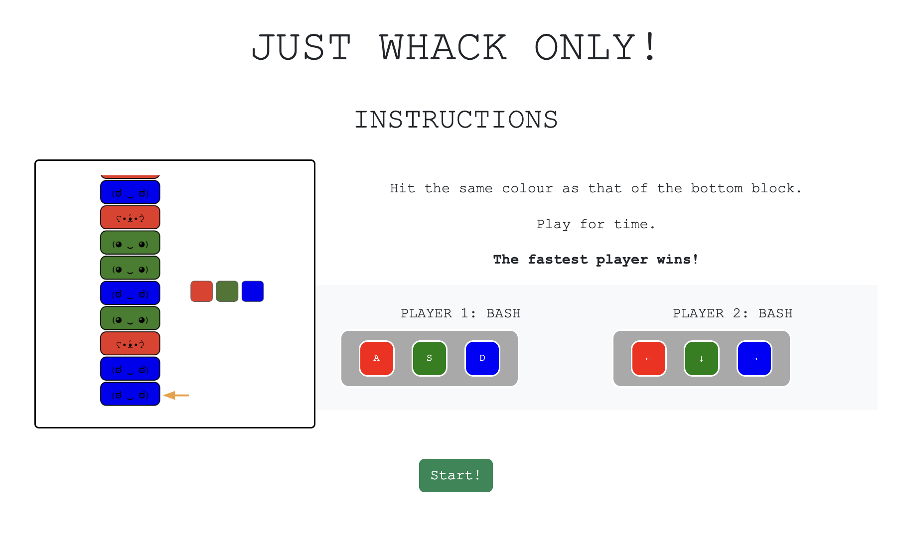
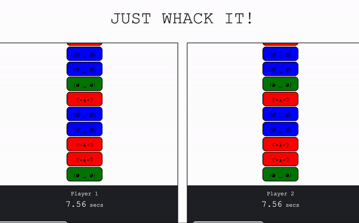

# <Hyper Bishi Bashwee>

A two-player arcade game where players play a series of competitive minigames against each other.
This is a branch created to work on the stretch goal.

# Screenshots

# Technologies Used

- JavaScript
- HTML
- CSS
- Bootstrap frontend toolkit
- [Ezgif gif maker][1] - to create instruction gifs

  [1]: ezgif.com/

# Getting Started

[Click to Play Hyper Bishi Bashwee!][2]
[MVP Version][3]

[2]: hyperbishibashwee.netlify.app
[3]: https://hyperbishibashweemvp.netlify.app/

# Version History

v1.0.0 [First version][2]

# Next Steps

- Competitive mode
- More mini-games

# Changelog

## 10 Jul 2023 - v1, single player

1. Create readme - done
2. Basic HTML and CSS - done
3. Render high score template - done
4. Render game board - done
5. Event listeners for navigation - done
6. Randomly generate game blocks - done
7. Event listeners to eliminate blocks - done
8. Win condition - done

## 11 Jul 2023 -

1. Fix "Play again" functionality - done
2. Add scorekeeping timer - done
3. Add high score and player names - done
4. Fix bug - one key clears two of the same blocks when playing again - done
5. Add instruction GIF - done
6. Add sound effects - done
7. Add negative case handling - done
   ###V1.0.0 Complete

## 12 Jul 2023 (Stretch goal)

1. Add Player 2 - done
2. Add player keys to instructions page - done
3. Use local storage to store high scores

   --v1.1.0 Complete--

4. Add one mini game

## 13 Jul 2023 (Stretch goal)

1. Player can select game
2. Styling
   --v1.2.0 Complete--
